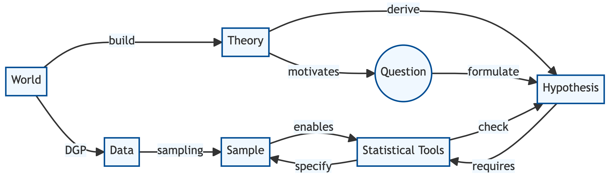

layout: true
<a style="position: absolute;top:5px;left:10px;color:#004c93;" target="Overview"  href="https://kaslides.netlify.app/">`r fontawesome::fa("home", height="15px")`</a>

---

```{r, load_refs, include = FALSE, echo=FALSE, cache=FALSE}
library(RefManageR)
BibOptions(check.entries = FALSE, 
           bib.style = "authoryear", 
           cite.style = 'authoryear', 
           style = "markdown",
           hyperlink = FALSE, 
           dashed = FALSE)
myBib <- ReadBib("../assets/example.bib", check = FALSE)

# packages
source('../assets/packages.R')

library(kableExtra)

counter <- function() {
  i <- 0
  function() {
    i <<- i + 1
    return(i)
  }
}

tbl_counter <- counter()
fig_counter <- counter()

# transparent images
library(tidyverse)
library(lubridate)
theme_set(theme_bw(base_size=12))
theme_update(panel.background = element_rect(fill = "transparent", colour = NA),
             plot.background = element_rect(fill = "transparent", colour = NA))

opts_chunk$set(
  dev.args=list(bg="transparent"),
  message = F, echo = F
  )
```

```{r xaringanExtra_progress-bar, echo = FALSE}
xaringanExtra::use_progress_bar(color = "#004c93", location = "bottom")
```

```{r xaringanExtra-clipboard_2, echo=FALSE}
# copy button styles mainly in ude.css 
# https://github.com/gadenbuie/xaringanExtra
htmltools::tagList(
  xaringanExtra::use_clipboard(
    button_text = "<i class=\"fa fa-clipboard\"></i>",
    success_text = "<i class=\"fa fa-check\" style=\"color: #00ff00\"></i>",
    error_text = "<i class=\"fa fa-times-circle\" style=\"color: #F94144\"></i>"
  ),
  rmarkdown::html_dependency_font_awesome()
)
```

# Empirical research
.vcenter[

- **Empirical research** is any research that uses structured observations from the real world to attempt to answer questions. 

- **Quantitative empirical** research is just empirical research that uses quantitative measurements (numbers, usually). More data sets, fewer interviews.

- One problem with quantitative empirical research is that the numbers that are observed often don’t tell exactly what we want to know.

- It turns out that, by doing right kind of research, we can get the *right kind of numbers*. By carefully designing the right kind of analysis, we can get the answer to our research question from the numbers.
]

---
# Why research needs a design

.vcenter[

- A lack of solid research design can be seen in the results, as well.

- Different studies seem to give different answers to research questions because they are not actually answering that question in the first place.

- For example:

 - Scientists may claim $2+2$ only has one answer
 - If you’re actually calculating something entirely different from $2+2$,  you might come back with an answer of $6$, or $1$, or $-52$
 - Then you wake up to a news headline reading that scientists have determined that $2+2=-52$

- There may not be a straightforward answer to our research question, but we must continue to try!
]

---
# What is a research question anyway?

.vcenter[
.blockquote[
### Key Koncept: Research question

A **research question** is a question

1. ... that *can be answered* and
2. ... for which having that answer will *improve our understanding of how the world works*.

A research questions takes us from a **theory** to an **hypothesis** that we can check using real world data. The data may provide **evidence** in favor or against our hypothesis.
]]

---
# What is a research question anyway? &mdash; ctd.

```{r, echo = F, out.width='85%',out.extra = 'style="display:block; margin-right:auto; margin-left:auto;margin-top:10%;"'}

```

---
# Research questions

.vcenter[
.blockquote[

### Example: The influence of smartphone usage on children

- Does heavy smartphone usage damage children's eyesight?

- Does smartphone usage stimulate creative or intellectual activity?

- Does smartphone usage reduce children's ability to concentrate?

]]

---
# Why not simply look for patterns in the data?

</br>

- We are living in an information economy, surrounding us by an increasing amount of readily available data

- Why not skip hassling with theories and research questions and simply look for *patterns* in the data?

- A lot of people do &mdash; this commonly referred to as **data mining**

<br>

.blockquote[
### Definition: Data Mining
Data mining is the systematic application of computer-aided methods to discover patterns, trends or correlations in (often large and connected) data sets. Algorithms based on statistical methods are frequently used for this purpose.
]

---
# Data mining
</br>

... is a useful toolkit if we care more about the *what* rather than the *why* : 

- Data mining is often good at

    - ... making *predictions under stability*.

    - ... finding patterns in the data. These may foster research questions that we can examine further in other data sources.
    
- Data mining is less good at

    - ... helping to come up with a good theory or to improve an existing one. 
    
    - ... producing valid inference. It has a tendency to find **false positives**.<sup>1</sup>

.footnote[[1] A false positive is a result that incorrectly indicates the presence of a condition under examination.]

---
# Data mining &mdash; predictions under stability

.vcenter[
.blockquote[

### Example: Predicting die roll outcomes

- By a stable mechanism we mean that the process giving us the data does not change

- If the process is "rolling a six-sided die" data mining would based on a thousand rolls would be great at predicting that the probability of observing a 1 is 1/6 

- If the process switches to "rolling a twenty-sided die", that data mining prediction will be bad: it will still predict a 1/6 chance of a 1 until it gets a lot more data. 

- Probability theory will properly predict the switch to a 1/20 chance immediately

]]

---
# Data mining &mdash; looking for patterns 

.vcenter[
.blockquote[

### Example: Viagra

**To find a pattern can make you rich**

- Pfizer scientists originally developed Viagra scientists to mitigate high blood pressure and angina.

- Famous side effects have been found using data mining: instead of coming to the data with a theory, the scientists noticed an interesting pattern in the data.

**Data mining is bad as a final step**

- Taking a pattern found as given would be problematic 

- Pfizer did clinical studies to *see if the pattern replicated*: they verified an hypothesis derived from their research question using experimental data.

]]

---
# So what makes a research question a *good* one?

**Simplicity**

  - Do not bundle a bunch of research questions into one.
    
  - Consider potential answers &mdash; research question and theory probably do not align very well if we cannot place potential answers within the framework of our theory.

**Feasibility / scalability **

  - A good research question can be answered using the right data. 
    
  - Data acquisition is often subject to constraints. Think time, money, data protection laws.

**Suitable research design**

  - The research design must be suitable to investigate the derived hypothesis.
  
  - Thoughtful consideration must be given as to which statistical method is appropriate. We will deal with this aspect in particular in this course.